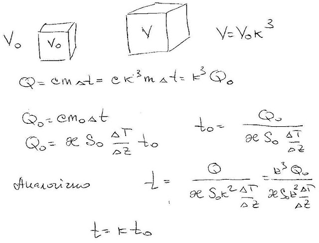

###  Условие:

$5.3.14.$ В разреженном газе нагретое тело остывает за время $t$. За какое время остынет тело из того же материала, если все его линейные размеры увеличить в $n$ раз?

###  Решение:

#### Ответ: ${t}' = nt$