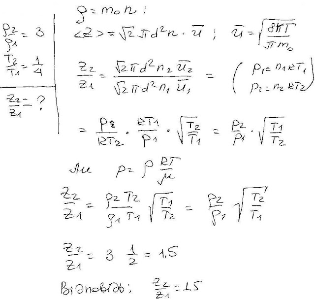

###  Условие: 

$5.3.4.$ Плотность газа увеличили в три раза, а температуру уменьшили в четыре раза. Как изменилось число столкновений молекул в единицу времени? 

###  Решение: 

 

###  Ответ: Увеличилось в $1.5$ раза 
