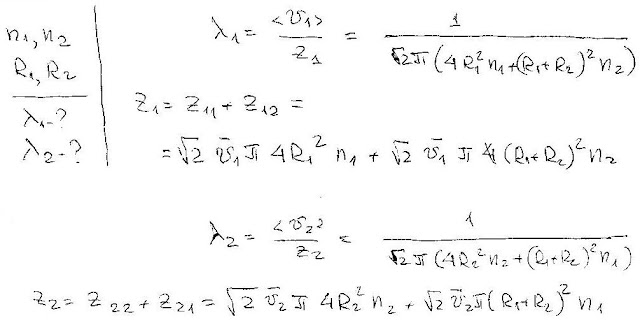
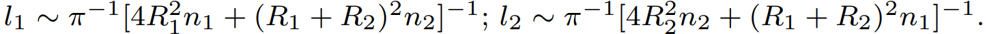

###  Условие: 

$5.3.5.$ В сосуде находится смесь двух газов. В единице объема смеси содержится $n_1$ молекул одного газа и $n_2$ молекул другого газа. Радиус молекул соответственно $R_1$ и $R_2$. Оцените длину свободного пробега молекул этих газов. 

###  Решение: 

 

###  Ответ: 

 
