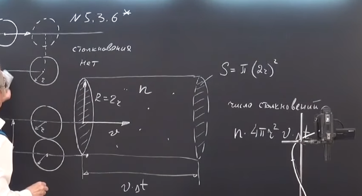
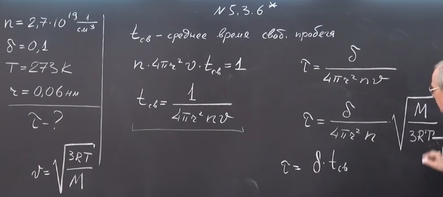
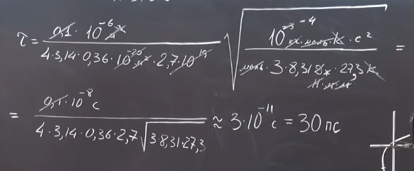

###  Условие: 

$5.3.6^{∗}.$ При нормальных условиях в $1$ $см^3$ атомарного водорода содержится $2.7 \cdot 10^{19}$ атомов. Оцените время, в течение которого $0.1$ часть атомов водорода превращается в молекулы водорода. Считать, что каждое столкновение двух атомов водорода приводит к образованию молекулы. Радиус атома водорода $0.06$ $нм$. 

###  Решение: 

 

 

 

 

###  Ответ: $t \approx 30$ пс 
