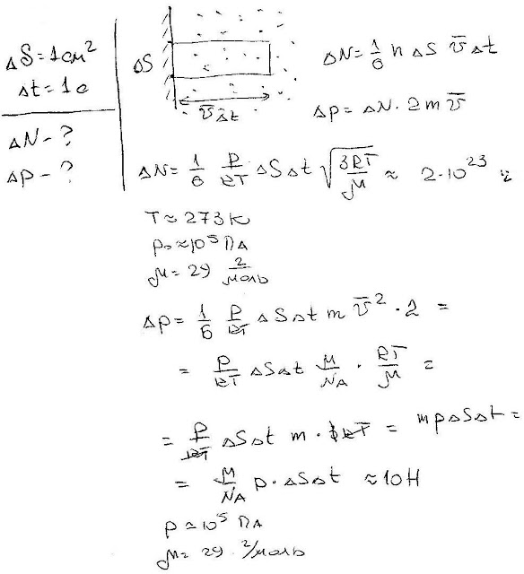

###  Условие:

$5.4.1.$ Оцените число молекул воздуха, попадающих на $1 \,см^2$ стены вашей комнаты в $1 \,с$, и импульс, переданный ими стене.

###  Решение:

###  Ответ:

$$
\nu\approx10^{24}\mathrm{~c}^{-1}\cdot\mathrm{cм}^{-2}{,}\quad\Delta p/\Delta t\approx10\mathrm{~H}.
$$