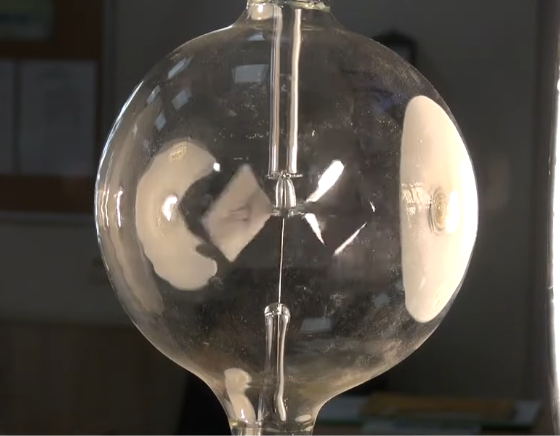
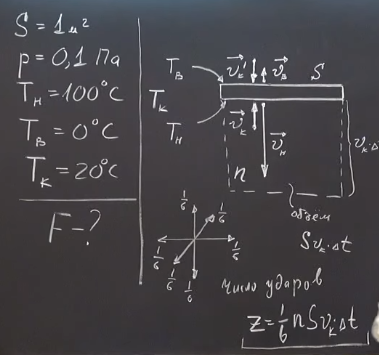

###  Условие:

$5.4.11^{∗}.$ Оцените подъемную силу пластины площадью $1$ $м^2$, нижняя поверхность которой находится при температуре $100^{\circ}C$, а верхняя — при $0^{\circ}C$ Температура воздуха $20^{\circ}C$, давление $0.1$ $Па$.

###  Решение:

###  Ответ: $ F \approx 10^{−2}$ Н