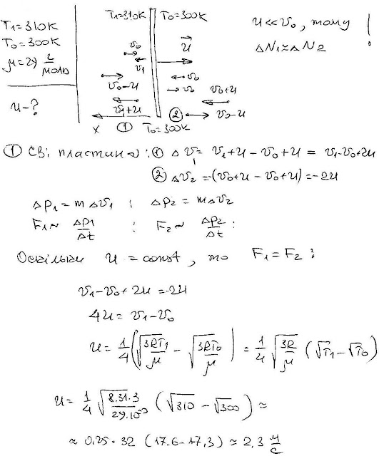

###  Условие:

$5.4.12.$ Оцените скорость, с которой будет двигаться в сильно разреженном воздухе плоский диск, одна из сторон которого нагрета до температуры $310 \,K$, а другая — до $300 \,K$. Температура воздуха $300 \,K$.

###  Решение:

#### Ответ: $v \approx 1 \,м/с.$