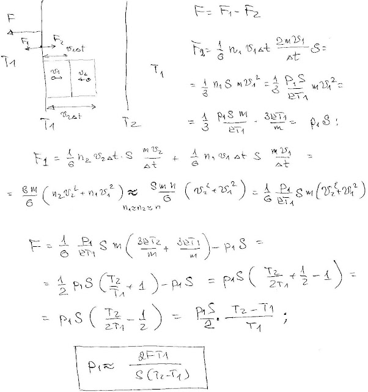
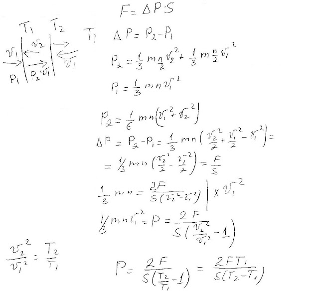

###  Условие:

$5.4.13^*.$ Две одинаковые параллельные пластины площади $S$ каждая расположены в сосуде близко друг к другу; их температура $T_1$ и $T_2$, температура стенок сосуда $T_1$. Пластины отталкиваются друг от друга с силой $F$. Оцените давление разреженного газа в сосуде.

###  Решение:

###  Аналогичное решение:

#### Ответ: $P \approx F T_1/[S(T_2 − T_1)]$