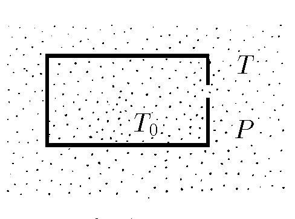

###  Условие: 

$5.4.14.$ В сосуде с газом поддерживается температура $T_0$. Вне его находится газ, давление которого $P$, а температура $T$. Чему равно давление газа внутри сосуда, если в стенке сосуда имеется небольшое отверстие? Газы разрежены. 

###  Решение: 

 

###  Ответ: $P_0 = P \sqrt{T_0/T}$ 
