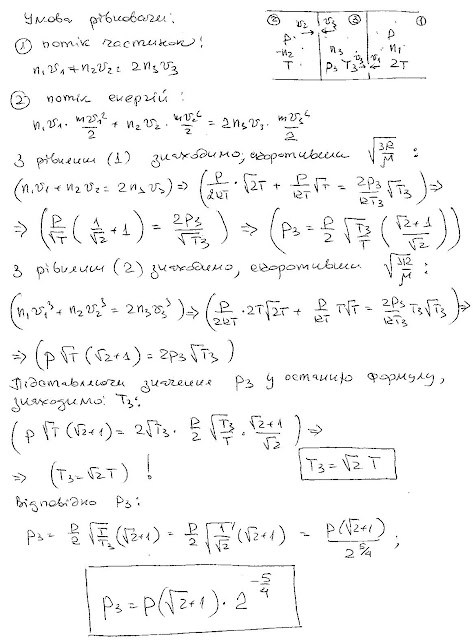

###  Условие: 

$5.4.15^*.$ Теплоизолированная полость сообщается через небольшие одинаковые отверстия с двумя другими полостями, содержащими газообразный гелий, давление которого поддерживается постоянным и равным $P$, а температура — равной $T$ в одной полости и $2T$ — в другой. Найдите давление и температуру, установившиеся внутри этой полости. Газы разрежены. :) 

###  Решение: 

 

####  Ответ: 

$$
P^{\prime}=P(1+\sqrt{2})\cdot2^{-5/4},\quad T^{\prime}=T\sqrt{2}.
$$