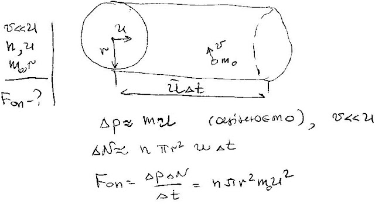

###  Условие: 

$5.4.3.$ В разреженном газе с постоянной скоростью $v$ движется шар радиуса $r$. Число молекул в единице объема газа $n$, масса молекулы $m$, тепловые скорости молекул значительно меньше скорости шара. Оцените силу сопротивления, действующую на шар. 

###  Решение: 

 

###  Ответ: $F \approx \pi r^2nmv^2$ 
