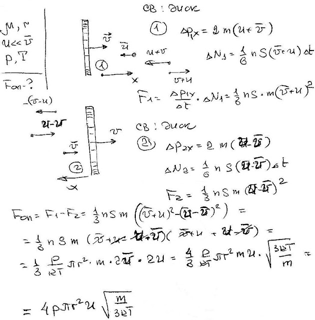

###  Условие:

$5.4.5.$ В разреженном газе с молярной массой $\mu$ движется диск радиуса $r$ с постоянной скоростью $v$, направленной вдоль оси диска. Оцените силу сопротивления, действующую на диск. Скорость диска много меньше тепловой скорости молекул. Давление газа $P$, его температура $T$.

###  Решение:

#### Ответ:

$$
F\approx4\pi r^2Pv\sqrt{\mu/(RT)},\mathrm{~где~}R\text{ 一 газовая постоянная}.
$$