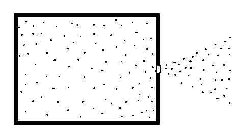
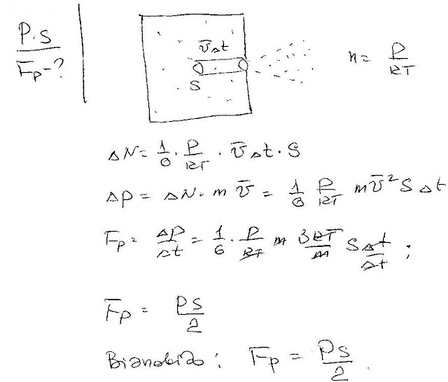

###  Условие:

$5.4.6.$ В сосуде находится газ под давлением $P$. В стенке сосуда имеется отверстие площади s, размеры которого малы по сравнению с длиной свободного пробега молекул газа. Определите реактивную силу, испытываемую сосудом при истечении газа в вакуумное пространство

###  Решение:

###  Ответ: $F = Ps/2$