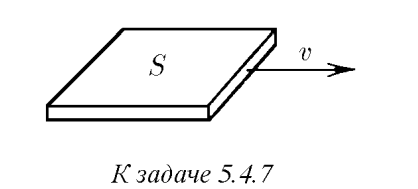

###  Условие: 

$5.4.7.$ В разреженном газе с молярной массой $\mu$ движется пластина так, как показано на рисунке. Оцените, какую силу необходимо прикладывать к пластине, чтобы она двигалась с постоянной скоростью $v$. Площадь пластины $S$, давление газа $P$, его температура $T$. Скорость пластины мала по сравнению с тепловой скоростью молекул. 

 

###  Решение: 

 

###  Ответ: $F \approx P Sv \sqrt{\mu /(RT)}$ 
