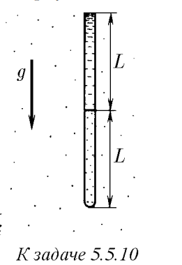

###  Условие: 

$5.5.10^*.$Нижний конец вертикальной узкой трубки $2L$ (в мм) запаян, а верхний открыт в атмосферу. В нижней половине трубки находится газ при температуре $T_0$, а верхняя ее половина заполнена ртутью. До какой минимальной температуры надо нагреть газ в трубке, чтобы он вытеснил всю ртуть? Внешнее давление в миллиметрах ртутного столба равно $L$. 

 

###  Решение: 

 

 

###  Ответ: $T = 9T_0/8$ 

### 
