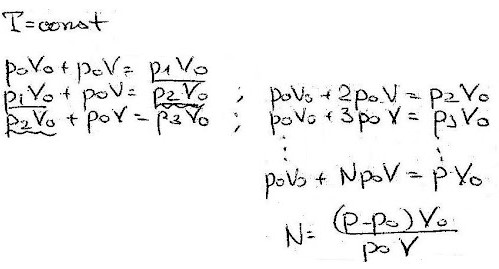
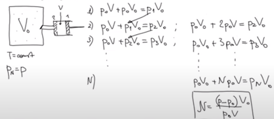

###  Условие:

$5.5.11.$ За сколько ходов поршневого насоса с рабочим объемом $V$ можно повысить давление с атмосферного $P_0$ до $P$ в сосуде, вместимость которого $V_0$? Нагревом газа пренебречь.

###  Решение:

###  Альтернативное решение:

#### Ответ: $n = (P − P_0)V_0/P_0V$