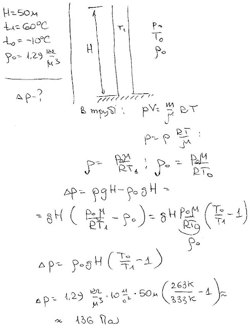

###  Условие: 

$5.5.15^*.$ Фабричная труба высоты $50 \,м$ выносит дым при температуре $60 \,^{\circ}C$. Определите перепад давления в трубе, обеспечивающий тягу. Температура воздуха $−10 \,^{\circ}C$, плотность воздуха $1.29 \,кг/м^3$ 

###  Решение: 

 

###  Ответ: $\Delta P = 137 \,Па$ 
