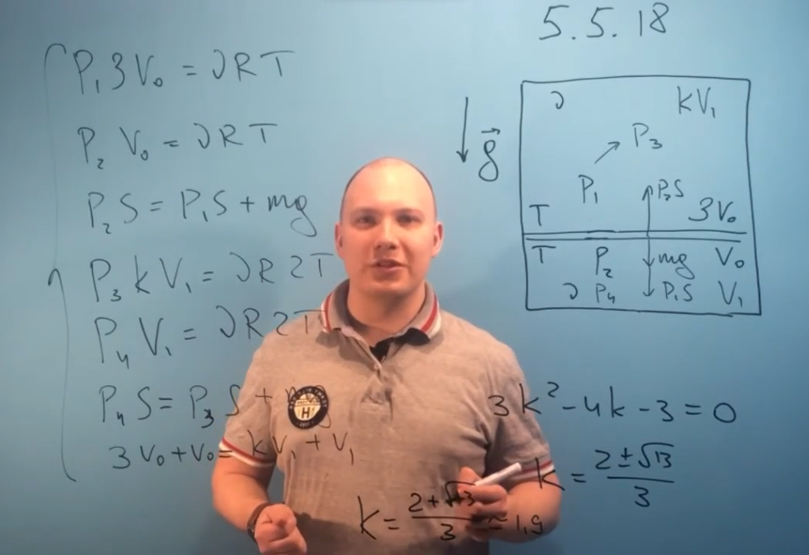

###  Условие:

$5.5.18.$ В цилиндрическом сосуде с газом находится в равновесии тяжелый поршень. Масса газа и его температура над поршнем и под ним одинакова. Отношение внутреннего объема верхней части сосуда к внутреннему объему нижней равно $3$. Каким будет это соотношение, если температуру газа увеличить в два раза?

###  Решение:

###  Ответ: $V_в/V_н = 1.9$