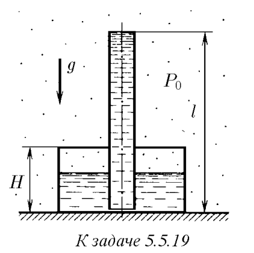
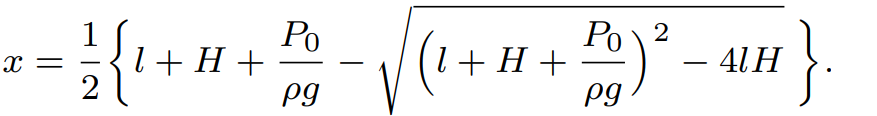

###  Условие: 

$5.5.19.$ В цилиндрический сосуд высоты $H$ через крышку вертикально вставлена немного не доходящая до дна сосуда тонкостенная трубка длины $l$. Соединение крышки с сосудом и трубкой герметично. В сосуд через трубку наливают жидкость. Найдите высоту уровня жидкости от дна сосуда, когда трубка заполняется жидкостью. Атмосферное давление $P_0$, плотность жидкости $\rho$. 

 

###  Решение: 

 

###  Ответ: 

 
