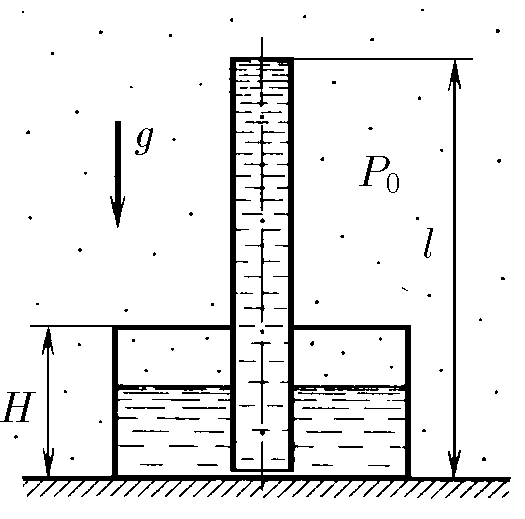
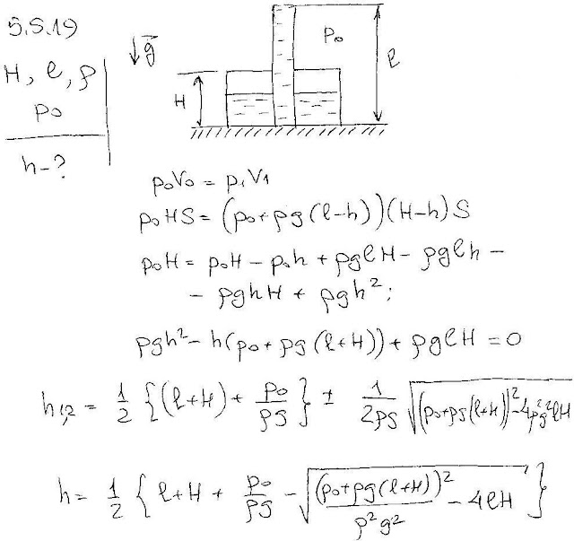

###  Условие:

$5.5.19.$ В цилиндрический сосуд высоты $H$ через крышку вертикально вставлена немного не доходящая до дна сосуда тонкостенная трубка длины $\ell$. Соединение крышки с сосудом и трубкой герметично. В сосуд через трубку наливают жидкость. Найдите высоту уровня жидкости от дна сосуда, когда трубка заполняется жидкостью. Атмосферное давление $P_0$, плотность жидкости $\rho$.

###  Решение:

#### Ответ:

$$
x=\frac{1}{2}\left [ \ell+H+\frac{P_0}{\rho g}-\sqrt{\left(\ell+H+\frac{P_0}{\rho g}\right)^2-4\ell H} ~\right ]
$$