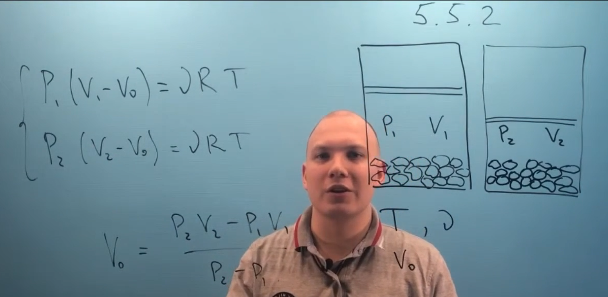

###  Условие:

$5.5.2.$ Для измерения собственного объема сыпучего материала его помещают в цилиндр, который герметически закрывают поршнем. Затем измеряют давление воздуха $P_1$ и $P_2$ при одной и той же температуре и двух положениях поршня, когда суммарный объем воздуха и материала равен $V_1$ и $V_2$. Каков объем материала по этим данным?

###  Решение:

#### Ответ: $V = (P_2V_2 − P_1V_1)/(P_2 − P_1)$