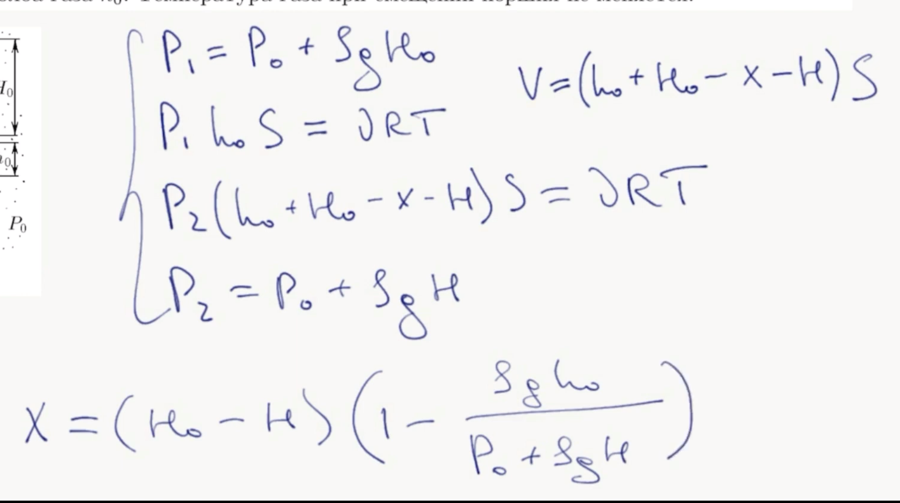

###  Условие: 

$5.5.20.$ В вертикальном цилиндрическом сосуде над поршнем $A$ находится газ, закрытый поршнем $B$, на который до верха цилиндра налита жидкость плоскости $\rho$. На какое расстояние $x$ надо поднять поршень $A$, чтобы над поршнем $B$ остался столб жидкости высоты $H$? Массой поршня $B$ и трением его о стенки пренебречь. Атмосферное давление $P_0$, начальная высота столба жидкости $H_0$, столба газа $h_0$. Температура газа при смещении поршня не меняется. 

###  Решение: 

 

 

###  Ответ: 

$$
\begin{aligned}
x=(H_0-H)\left(1-\frac{\rho gh_0}{P_0+\rho gH}\right).
\end{aligned}
$$