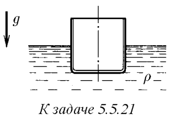
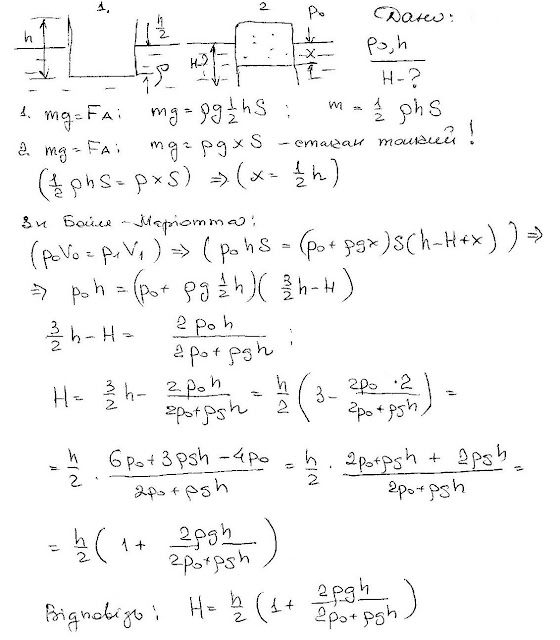
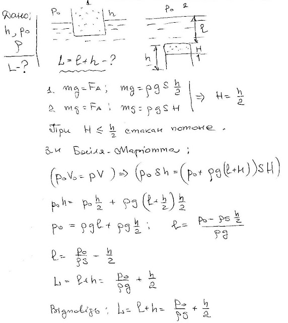

###  Условие: 

$5.5.21.$ На поверхности жидкости плотности $\rho$ плавает цилиндрический тонкостенный стакан, наполовину погруженный в жидкость. а. На сколько погрузится стакан в жидкость, если его поставить на поверхность жидкости вверх дном? Высота стакана $h$, давление воздуха $P_0$. б. На какую глубину нужно погрузить перевернутый вверх дном стакан, чтобы он вместе с заключенным в нем воздухом пошел ко дну? 

 

###  Решение: 

 

###  Аналогичное решение: 

 

###  Ответ: 

$\text{a. }H=\frac{h}{2}\left(1+\frac{2\rho gh}{2P_0+\rho gh}\right).\quad\text{б. }H=\frac{h}{2}+\frac{P_0}{\rho g}.$ 
