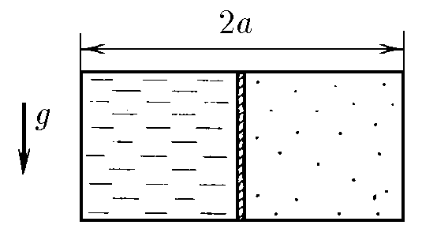
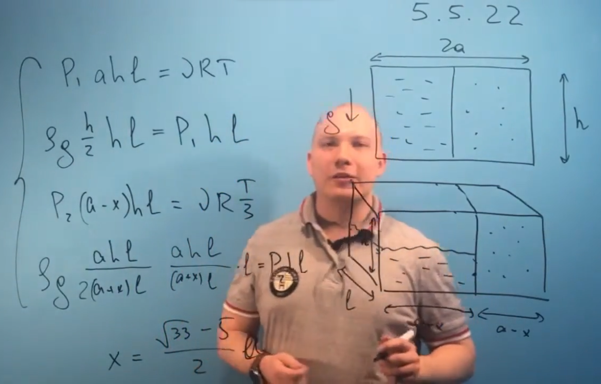

###  Условие: 

$5.5.22.$ В прямоугольном сосуде с непроницаемыми стенками находится слева тяжелая жидкость (например, ртуть), отделенная подвижным тонким поршнем от воздуха в правой части сосуда. В начальный момент поршень находится в равновесии и делит объем сосуда пополам. На сколько смещается поршень вправо, если температура системы уменьшается в три раза? Тепловым расширением ртути и стенок сосуда пренебречь. Трения нет. Длина сосуда $2a$. 

###  Решение: 

 

 

###  Ответ: $x = \frac{ \sqrt {33} - 5}{2}a$ 
