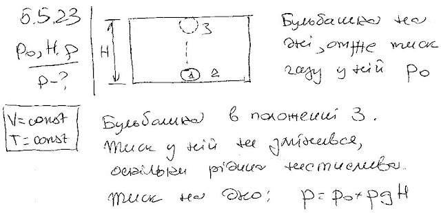

###  Условие: 

$5.5.23^∗.$ Герметически закрытый бак заполнен жидкостью так, что на дне его имеется пузырек воздуха. Давление на дно бака $P_0$. Каким оно станет, если пузырек воздуха всплывет? Высота бака $H$, плотность жидкости $\rho$. 

###  Решение: 

 

###  Ответ: $P = P_0 + \rho gH$ 
