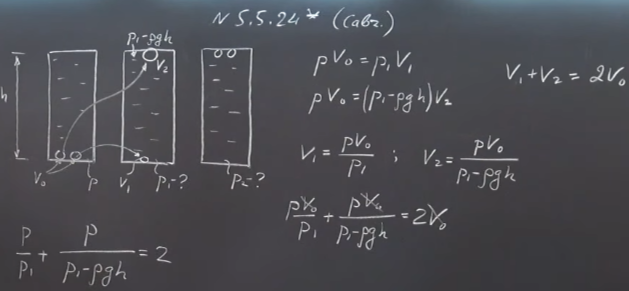
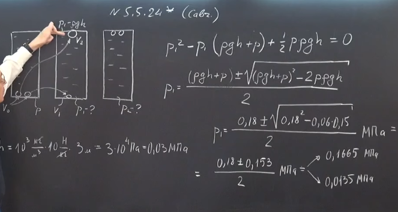

###  Условие: 

$5.5.24^{∗}.$ Герметически закрытый бак высоты $3\,м$ заполнен водой так, что на дне его находятся два одинаковых пузырька воздуха. Давление на дно бака $0.15\,МПа$. Каким станет давление, если всплывет один пузырек? два пузырька? 

###  Решение: 

 

 

 

###  Ответ: $ P_1 = 0.17\,МПа,$ $ P_2 = 0.18\,МПа$ 
