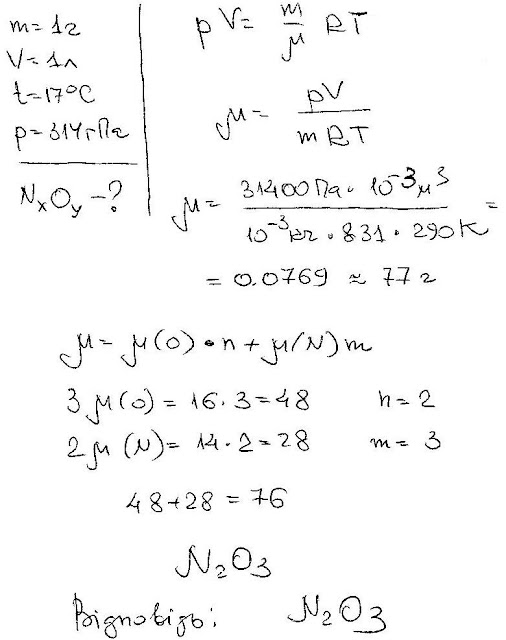

###  Условие:

$5.5.25.$ Найдите формулу соединения азота с кислородом, если 1 г его в газообразном состоянии в объеме $1 \,л$ создает при температуре $17 \,^{\circ}C$ давление $0.314 \,атм$.

###  Решение:

#### Ответ: $N_2O_3$