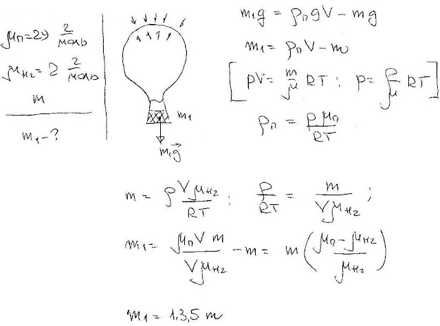

###  Условие: 

$5.5.28.$ Водород заполняет только верхнюю часть оболочки стратостата. В нижней части находится воздух, свободно проникающий в оболочку через имеющееся снизу отверстие. При какой наибольшей массе стратостат станет подниматься, если масса водорода в оболочке равна $m$? 

###  Решение: 

 

###  Ответ: $M = 13.5m$ 
