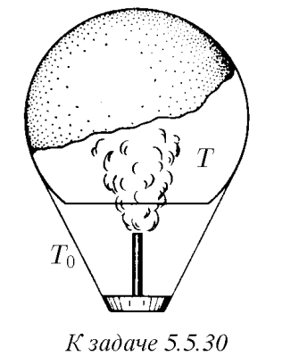

###  Условие: 

$5.5.30.$ Воздух внутри оболочки воздушного шара вместимости $V$ нагревается газовой горелкой до температуры $T$, превышающей температуру $T_0$ окружающего воздуха. Какова при атмосферном давлении $P_0$ грузоподъемность этого воздушного шара? Молярная масса воздуха $\mu$. 

 

###  Решение: 

 

###  Ответ: $m = \mu P_0V (T − T_0)/(RT T_0)$ 
