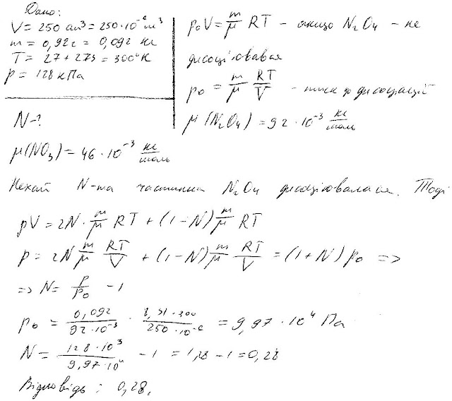

###  Условие: 

$5.5.32.$ При комнатной температуре четырехокись азота частично диссоциирует, превращаясь в двуокись азота: $N_2O_4 \rightleftharpoons 2NO_2$. В откачанный сосуд вместимости $250 \,см^3$ вводится $0.92 \,г$ жидкости $N_2O_4$ при $0 \,^{\circ}C$. Когда температура в сосуде увеличивается до $27 \,^{\circ}C$, жидкость целиком испаряется, а давление становится равным $128 \,кПа$. Определите долю четырехокиси азота, которая диссоциировала. 

###  Решение: 

 

###  Ответ: $N = 0.28$ 
