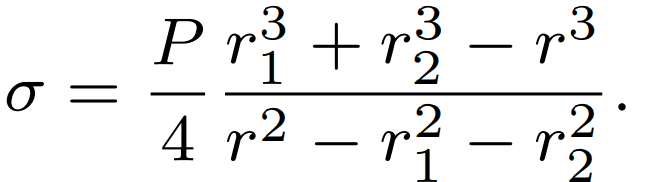

###  Условие: 

$5.5.34.$ Два мыльных пузыря радиуса $r_1$ и $r_2$ сливаются в один. Найдите поверхностное натяжение мыльной воды, если радиус образовавшегося пузыря равен $r$, а атмосферное давление равно $P_0$. 

###  Решение: 

 

###  Ответ: 

 
