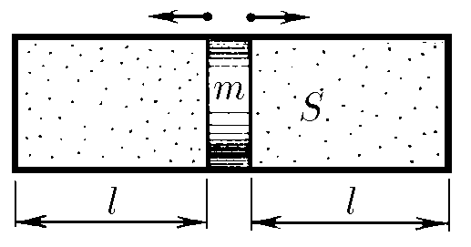
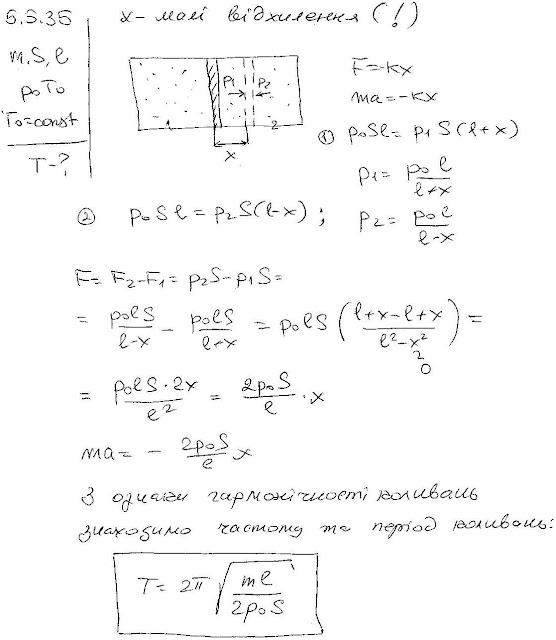

###  Условие:

$5.5.35.$ Найдите период малых колебаний поршня массы $m$, разделяющего гладкий цилиндрический сосуд сечения $S$ на две части длины $l$ каждая. По обе стороны от поршня находится газ при давлении $P_0$ и температуре $T_0$. При колебании поршня температура газа не меняется.

###  Решение:

#### Ответ: $T = 2\pi\sqrt{ml/(2P_0S)}.$