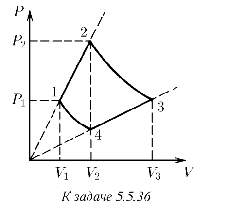
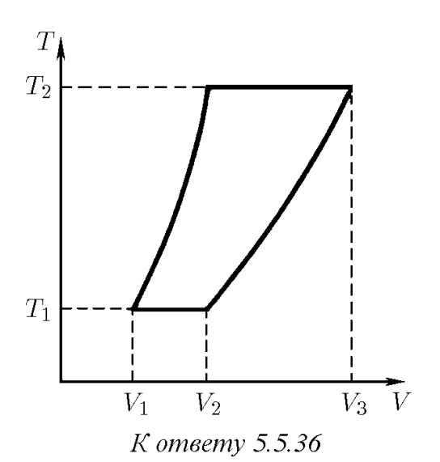

###  Условие: 

$5.5.36.$ Один моль газа участвует в процессе, график которого изображен на $P$, $V$-диаграмме. Участки $1–2$ и $3–4$ графика — отрезки прямых, продолжения которых проходят через начало координат, а кривые $1–4$ и $2–3$ — изотермы. Нарисуйте график этого процесса на $T$, $V$ -диаграмме. Найдите объем $V_3$, если известны объемы $V_1$ и $V_2 = V_4$. 

 

###  Решение: 

 

###  Ответ: $V_3 = V_2^2 /V_1$ 

 
