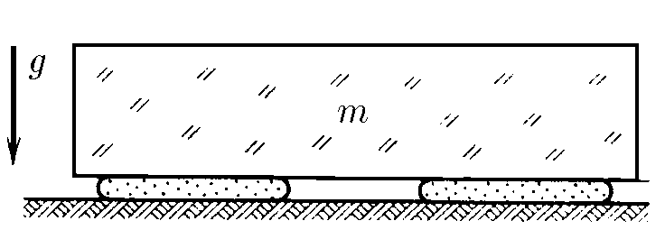
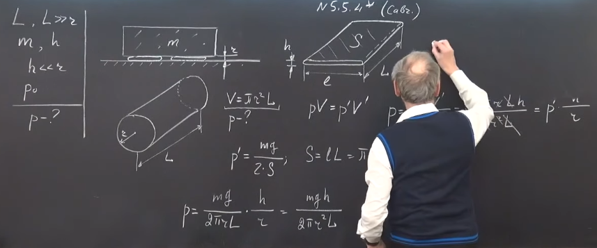
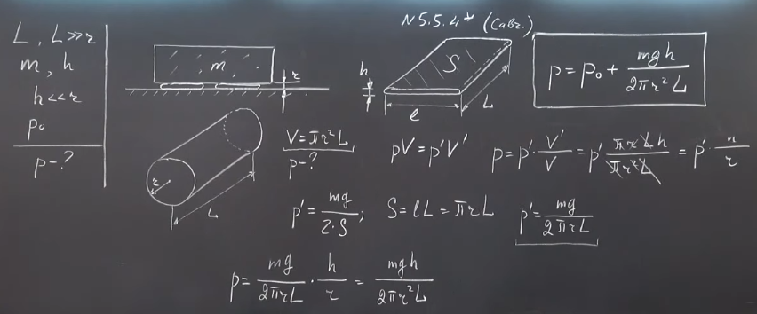

###  Условие: 

$5.5.4^{∗}.$ На два длинных цилиндрических мешка радиуса $r$ и длины $L \gg r$, сделанных из нерастяжимого материала и заполненных газом, положили плиту массы $m$, в результате чего они сплющились до толщины $h \ll r$. Внешнее давление $P_0$. Определите начальное давление в мешках, если температура газа в них не изменялась. 

###  Решение: 

 

 

 

###  Ответ: $ P = P_0 + mgh/(2\pi r^2L)$ 
