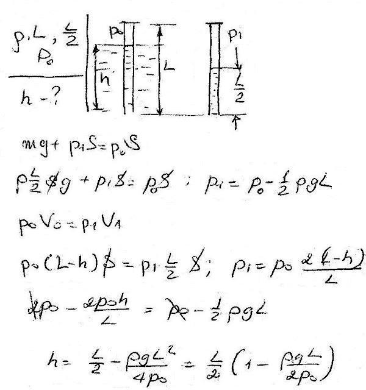

###  Условие:

$5.5.6.$ На какую глубину в жидкость плотности $\rho$ надо погрузить открытую трубку длины $L$, чтобы, закрыв верхнее отверстие, вынуть столбик жидкости высоты $L/2$? Атмосферное давление $P$.

###  Решение:

#### Ответ: $x = L(1 + \rho gL/2P)/2$