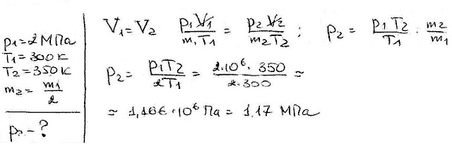

###  Условие: 

$5.5.7.$ Газ находится в сосуде при давлении $2 \,МПа$ и температуре $27 \,^{\circ}C$. После нагревания на $50 \,^{\circ}C$ в сосуде осталась только половина газа (по массе). Определите установившееся давление. 

###  Решение: 

 

###  Ответ: $P = 1.166 \,МПа$ 
