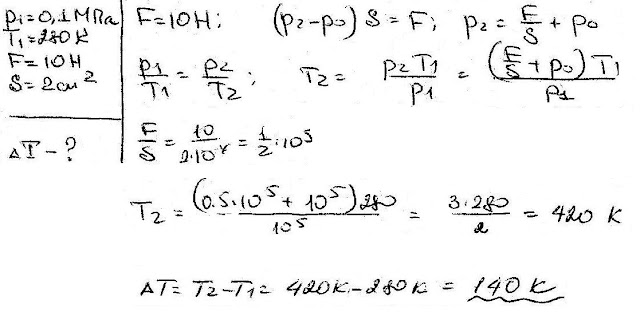

###  Условие:

$5.5.8.$ Давление воздуха внутри бутылки равно $0.1 \,МПа$ при температуре $7 \,^{\circ}C$. На сколько нужно нагреть бутылку, чтобы пробка вылетела? Без нагревания пробку можно вынуть, прикладывая к ней силу $10 \,Н$. Сечение пробки $2 \,см^2$.

###  Решение:

#### Ответ: $\Delta t = 140 \,^{\circ}C$