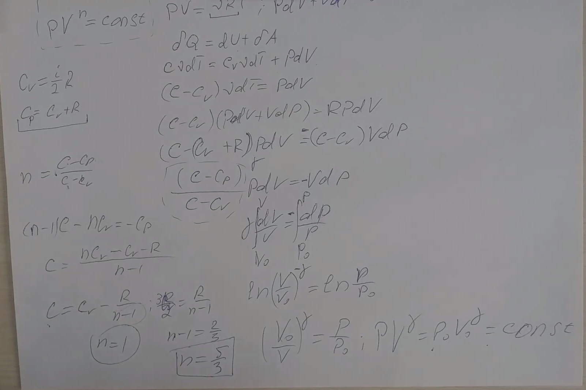

###  Условие: 

$5.6.28^{∗}.$ Найдите молярную темлоемкость одноатомного газа, расширяющегося по закону $P V^n = const$. При каких значениях $n$ теплоемкость будет равна нулю? бесконечности? 

#####  Аналогичная, более расширенная задача [была представленна](BelPhO.pdf) на 3 этапе [Белорусской Физической Олимпиады](https://belphol.github.io/) в 2023 среди 10х классов 

###  Решение: 

 

 

###  Альтернативное решение: 

 

###  Ответ: 

$$
c=(1/(1-n)+3/2)R,\quad n=5/3;n=1.
$$