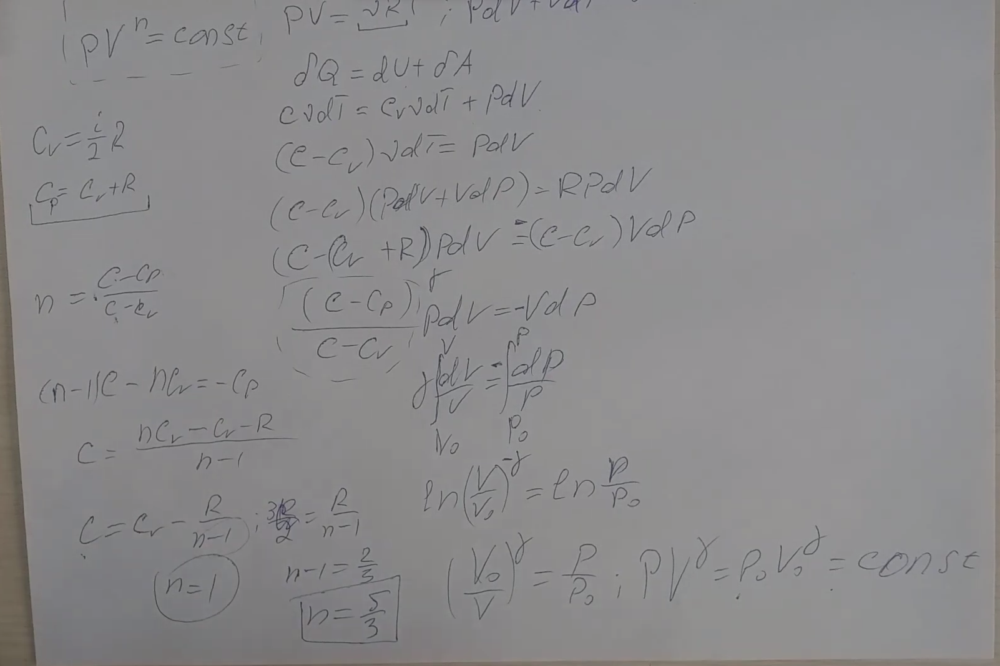

###  Условие:

$5.6.28^{∗}.$ Найдите молярную темлоемкость одноатомного газа, расширяющегося по закону $P V^n = const$. При каких значениях $n$ теплоемкость будет равна нулю? бесконечности?

#####  Аналогичная, более расширенная задача [была представленна](http://belpho.org/Thermodynamics/2023/3_etap_2023_10_3_probl.pdf) на 3 этапе [Белорусской Физической Олимпиады](http://belpho.org/) в 2023 среди 10х классов ([решение](http://belpho.org/Thermodynamics/2023/3_etap_2023_10_3_sol.pdf))

###  Решение:

###  Альтернативное решение:

#### Ответ:

$$
c=(1/(1-n)+3/2)R,\quad n=5/3;n=1.
$$