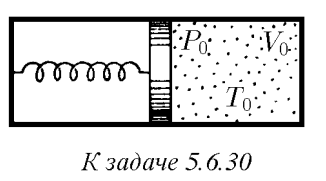

###  Условие: 

$5.6.30^{∗}.$ Найдите теплоемкость системы, состоящей из перекрытого поршнем сосуда с одноатомным газом (параметры газа $P_0$, $V_0$, $T_0$). Поршень удерживается пружиной. Слева от поршня вакуум. Если газ откачать, поршень соприкоснется с правой стенкой сосуда, а пружина будет не деформирована. Теплоемкостями сосуда, поршня и пружины пренебречь. 

 

###  Решение: 

 

 

 

###  Ответ: $c = 2P_0V_0/T_0$ 
