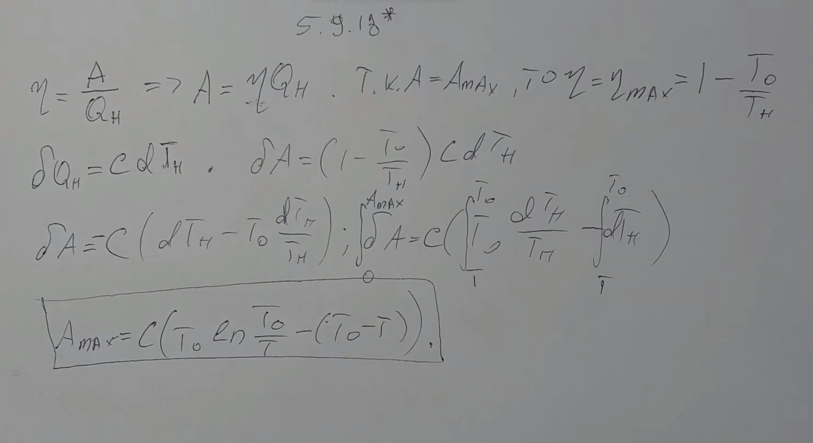

###  Условие:

$5.9.18^{∗}.$ Нагретое тело с начальной температурой $T$ используется в качестве нагревателя в тепловой машине. Теплоемкость тела не зависит от температуры и равна $C$. Холодильником служит неограниченная среда, температура которой постоянна и равна $T_0$. Найдите максимальную работу, которую можно получить за счет охлаждения тела.

###  Решение:

#### Ответ

$$
A = C[T − T_0 − T_0 \, \ln(T /T_0)]
$$