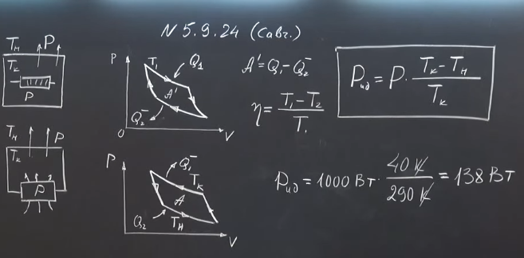

###  Условие:

$5.9.24^{∗}.$ С помощью электрической плитки мощностью $1\,кВт$ в комнате поддерживается температура $17\,^{\circ}C$ при температуре наружного воздуха $-23\,^{\circ}C$. Какая мощность потребовалась бы для поддержания в комнате той же температуры с помощью идеальной тепловой машины?

###  Решение:

###  Ответ: $N = 138\,Вт$