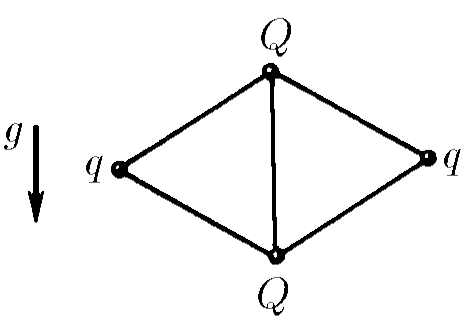

###  Условие

$6.1.10.$ Четыре положительных заряда $q, Q, q, Q$ связаны пятью нитями так, как показано на рисунке. Длина каждой нити $l$. Определите силу натяжения нити, связывающей заряды $Q > q$.

### Решение

Углы между нитями равны $60^{\circ}$ (равносторонние треугольники). Распишем проекции сил, действующих на $q$, на ось, параллельную отрезку $qq$:

$$
F_{qq}+2F_{Qq} \cdot \cos{30 ^{\circ}}-2T_{Qq} \cdot \cos{30 ^{\circ}}=0
$$

Сила электростатического взаимодействия между зарядами $q$ и $Q$ можно выразить через закон Кулона:

$$
\frac{1}{4\pi\varepsilon_0}\frac{q^2}{(2l\cos{30 ^{\circ}})^2}+2\frac{1}{4\pi\varepsilon_0}\frac{qQ}{l^2} \cdot \cos{30 ^{\circ}}-2T_{Qq} \cdot \cos{30 ^{\circ}}=0
$$

Из этого равенства выражаем силу натяжения нити $T_{Qq}$ между зарядами $q$ и $Q$

$$
T_{Qq}=\frac{1}{4\pi\varepsilon_0}\frac{q(q+Q3\sqrt{3})}{3\sqrt{3}l^2}
$$

Математические преобразования

$$
T_{Qq}=\frac{1}{4\pi\varepsilon_0} \cdot \left(\frac{q^2}{8l^2\cdot\cos^3{30 ^{\circ}}}+\frac{qQ}{l^2}\right)
$$

$$
T_{Qq}=\frac{1}{4\pi\varepsilon_0}\frac{q(q+Q(8(\cos{30 ^{\circ}})^3))}{8(\cos{30 ^{\circ}})^3l^2}
$$

$$
T_{Qq}=\frac{1}{4\pi\varepsilon_0}\frac{q(q+Q3\sqrt{3})}{3\sqrt{3}l^2}
$$

Аналогично с $Q$ и осью $QQ$:

$$
T_{QQ}+2T_{Qq} \cdot \cos{60 ^{\circ}}-2F_{Qq} \cdot \cos{60 ^{\circ}}-F_{QQ}=0
$$

После перегруппировки слагаемых, получаем выражение для силы натяжение нити соединяющей заряды $Q$

$$
T_{QQ}=F_{Qq}+F_{QQ}-T_{Qq}
$$

Подставляя значения силы кулона и силу натяжения нити $T_{Qq}$ между зарядами $q$ и $Q$

$$
T_{QQ}=\frac{1}{4\pi\varepsilon_0}\frac{qQ}{l^2}+\frac{1}{4\pi\varepsilon_0}\frac{QQ}{l^2}-\frac{1}{4\pi\varepsilon_0}\frac{q(q+Q3\sqrt{3})}{3\sqrt{3}l^2}
$$

$$
T_{QQ}=\frac{1}{4\pi\varepsilon_0} \cdot \frac{1}{l^2}\left(Q^2-\frac{q^2}{3\sqrt{3}}\right)
$$

#### Ответ

$$
T_{QQ}=\frac{1}{4\pi\varepsilon_0} \cdot \frac{1}{l^2}\left(Q^2-\frac{q^2}{3\sqrt{3}}\right)
$$