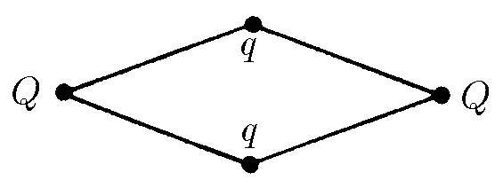

###  Условие

$6.1.11.$ Четыре положительных заряда $Q, q, Q, q$ связаны четырьмя нитямитак, как показано на рисунке. Длина каждой нити $\ell$. Определите углы между нитями.

### Решение

Обозначим углы при $Q$ за $\varphi$, тогда угол при $q$: $\pi -\varphi$.

Распишем проекции сил, действующих на $Q$, на ось, параллельную отрезку $QQ$:

$$
F_{QQ}+2F_{Qq} \cdot \cos{\varphi/2}-2T \cdot \cos{\varphi/2}=0
$$

$$
F=\frac{Q}{4\pi\varepsilon_0\ell^2}\left(\frac{Q}{(4\cos^2{\varphi/2}}+2q \cos{\varphi/2}\right) -2T \cos{\varphi/2}
$$

Выражаем силу натяжения нити

$$
T=\frac{1}{\ell^2}\left(\frac{Q^2}{(2\cos{\varphi/2})^3}+qQ\right)
$$

Аналогично с $q$ и осью $qq$:

$$
F_{qq}+2F_{Qq} \cdot \cos{\frac{\pi -\varphi}{2}}-2T \cdot \cos{\frac{\pi -\varphi}{2}}=0
$$

Математические преобразования

$$
F=\frac{1}{4\pi\varepsilon_0}\left[\frac{q^2}{(2\ell\sin{\varphi/2})^2}+2\frac{qQ}{\ell^2} \cdot \sin{\varphi/2}-\\\\-2\frac{1}{\ell^2}\left(\frac{Q^2}{(2\cos{\varphi/2})^3}+qQ\right) \cdot \sin{\varphi/2}\right]=0
$$

$$
\frac{1}{4\pi\varepsilon_0}\frac{1}{\ell^2}\left(\frac{q^2}{(2\sin{\varphi/2})^3}-\frac{Q^2}{(2\cos{\varphi/2})^3}\right)=0
$$

Откуда получаем тригонометрическое соотношение для системы зарядов

$$
\frac{q^2}{(\sin{\varphi/2})^3}-\frac{Q^2}{(\cos{\varphi/2})^3}=0
$$

Разделив одну часть на другую, находим искомый угол

$$
\tan^3{\varphi/2}=\frac{q^2}{Q^2} \Rightarrow \boxed{\varphi=2 \cdot \arctan {\left(\frac{q}{Q}\right)^{2/3}}}
$$

#### Ответ

$$
\varphi=2 \cdot \arctan {\left(\frac{q}{Q}\right)^{2/3}}
$$

$$
\pi-\varphi=\pi -2 \cdot \arctan {\left(\frac{q}{Q}\right)^{2/3}}
$$