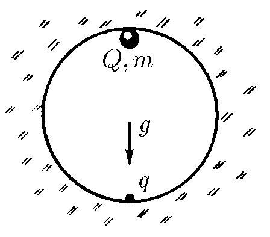
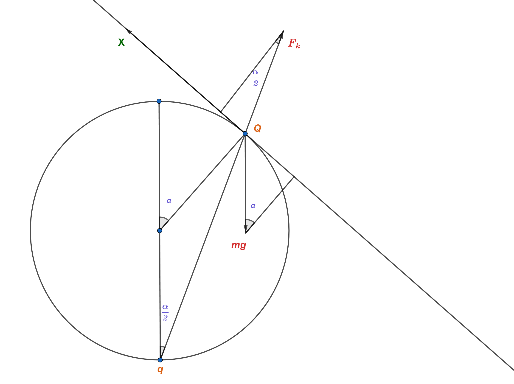

###  Условие

$6.1.14.$ Какой минимальный заряд $q$ нужно закрепить в нижней точке сферической полости радиуса $R$, чтобы в поле тяжести небольшой шарик массы $m$ и заряда $Q$ находился в верхней точке полости в положении устойчивого равновесия?

### Решение

Если решать данную задачу через условие равновесия

$$
F_k=mg,
$$

то вы получите неверный ответ, т.к. такое равновесие будет неустойчивым.

Для проверки устойчивости необходимо отклонить шарик на малый угол $\alpha\longrightarrow0$; $(\sin{\alpha}\approx\alpha)$ и рассмотреть, при каких $q$ будет возникать возвращающая сила.

Следует заметить, что при малых отклонениях силу Кулона можно считать постоянной

$$
F_k=\text{const}=\frac{1}{4\pi\varepsilon_0}\frac{qQ}{4R^2}
$$

Рассмотрим проекции сил на ось $Ox$, параллельную касательной к сфере в точке контакта с шариком (наклонена под углом к $\alpha$ горизонту):

$$
(mg)_x=-mg \cdot \sin{\alpha}
$$

$$
(N)_x=0
$$

$$
(F_k)_x=F_k \cdot \sin{\alpha /2}
$$

В данном случае сила Кулона должна быть существенно больше mg, т.е. шарик не упадёт, но может скатиться по стенке, а значит равновесие будет являться устойчивым, если сумма проекций всех сил на $Ox$ будет больше нуля

$$
F_k \cdot \sin{\alpha /2}-mg \cdot \sin{\alpha}=0
$$

$$
F_k=mg \cdot \frac{\alpha}{\alpha /2}
$$

$$
\frac{1}{4\pi\varepsilon_0}\frac{qQ}{4R^2}=2mg
$$

$$
q=\frac{32\pi\varepsilon_0mgR^2}{Q}
$$

###  Альтернативное Решение:

###  Альтернативное Решение:

#### Ответ: $q \geq \frac{32 \pi\varepsilon_{0} m g R^{2}}{Q}$