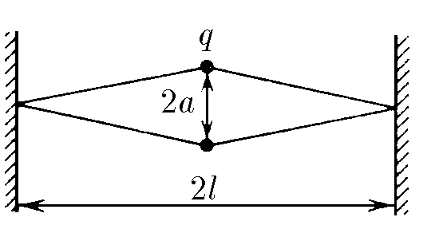

###  Условие: 

$6.1.15.$ Два заряда $q$, соединенных резиновыми шнурами с неподвижными стенками так, как показано на рисунке, находятся на расстоянии $2a$ друг от друга. Расстояние между стенками $2l$, длина каждого недеформированного шнура $l$. Определите их жесткость. 

 

###  Решение: 

$\varphi$ - угол между двумя шнурами, присоединёнными к одному заряду, $\tan{\varphi/2}=\frac{l}{a}$. Проекции сил, действующих на заряд, на ось qq: $F_k(2a)-2F_{\text{у}} \cdot \cos{\varphi/2}=0$ $\frac{1}{4\pi\varepsilon_0}\frac{q^2}{4a^2}=2k\Delta{x} \cdot \cos{\varphi/2}$ $\frac{1}{4\pi\varepsilon_0}\frac{q^2}{4a^2}=2k(\sqrt{a^2+l^2}-l) \cdot \frac{a}{\sqrt{a^2+l^2}}$ $k=\frac{q^2\sqrt{a^2+l^2}}{32\pi\varepsilon_0a^3\sqrt{a^2+l^2}}$ 

###    
Ответ: $\frac{q^2\sqrt{a^2+l^2}}{32\pi\varepsilon_0a^3\sqrt{a^2+l^2}}$ 
