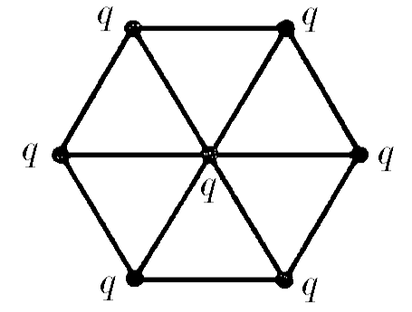

###  Условие: 

$6.1.16^*.$ Семь одинаковых зарядов $q$ связаны друг с другом одинаковыми упругими нитями так, как показано на рисунке. Расстояние между ближайшими зарядами $l$. Определите силу натяжения каждой нити. 

 

###  Решение: 

В данной задаче многоуважаемый Оливер Яковлевич Савченко ввиду своей невнимательности забыл указать, что заряды образуют правильные треугольники. Значит, растяжения нитей одинаковы, а значит одинаковы и силы упругости, с которыми они действуют на заряды. Обозначим $\frac{1}{4\pi\varepsilon_0}\frac{q^2}{l^2}=F_0$ и распишем проекции сил, действующих на заряд при вершине шестиугольника, на ось главной диагонали (1. центральный заряд, 2.соседние по ребру 3. 2 заряды, смежные с самым дальним, 4. самый дальний): $T+2T \cdot \cos{60^{\circ}}=(1)F_0+(2)2F_0 \cdot \cos{60^{\circ}}+$$(3)2\frac{F_0}{(2\frac{\sqrt{3}}{2})^2} \cdot \cos{30^{\circ}}+(4)\frac{F_0}{2^2}$ $2T=2F_0+F_0/\sqrt{3}+F_0/4$ $T=\frac{9\sqrt{3}+4}{8\sqrt{3}}F_0=\frac{9\sqrt{3}+4}{8\sqrt{3}}\frac{1}{4\pi\varepsilon_0}\frac{q^2}{l^2}$ 

###  Ответ: $\frac{9\sqrt{3}+4}{8\sqrt{3}}\frac{1}{4\pi\varepsilon_0}\frac{q^2}{l^2}$ 
