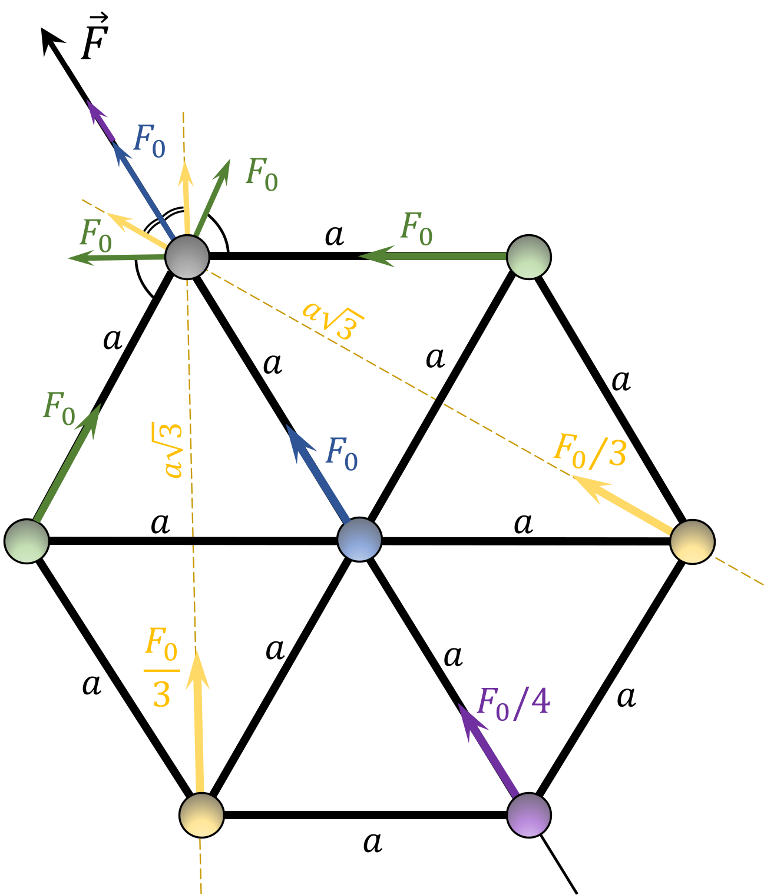

###  Условие: 

$6.1.16^*.$ Семь одинаковых зарядов $q$ связаны друг с другом одинаковыми упругими нитями так, как показано на рисунке. Расстояние между ближайшими зарядами $l$. Определите силу натяжения каждой нити. 

 

###  Решение: 

В данной задаче многоуважаемый Оливер Яковлевич Савченко ввиду своей невнимательности забыл указать, что заряды образуют правильные треугольники. Значит, растяжения нитей одинаковы, а значит одинаковы и силы упругости, с которыми они действуют на заряды. Обозначим 

$$F_0 = \frac{1}{4\pi\varepsilon_0}\frac{q^2}{a^2}\tag{1}$$ 

и распишем проекции сил, действующих на заряд при вершине шестиугольника, на ось главной диагонали (1. $\color{blue}{\text{центральный заряд}}$, 2. $\color{green}{\text{соседние по ребру}}$, 3. $\color{orange}{\text{2 заряды, смежные с самым дальним}}$, 4. $\color{purple}{\text{самый дальний}}$): 

$$
T + 2T \cdot \cos{60^\circ} = \color{blue}{F_0} + \color{green}{2F_0 \cdot \cos{60^\circ}} + \color{orange}{2\frac{F_0}{(2\frac{\sqrt{3}}{2})^2} \cdot \cos{30^\circ}} + \color{purple}{\frac{F_0}{2^2}}\tag{2}
$$

Упрощаем выражение

$$
2T = \color{blue}{2F_0} + \color{green}{\frac{F_0}{\sqrt{3}}} + \color{purple}{\frac{F_0}{4}}\tag{3}
$$

Выражаем силу натяжения нити

$$
T=\frac{9\sqrt{3}+4}{8\sqrt{3}}F_0
$$

Подставляем силу Кулона $F_0$ из уравнения $(1)$:

$$
T=\frac{9\sqrt{3}+4}{8\sqrt{3}}\frac{1}{4\pi\varepsilon_0}\frac{q^2}{a^2}\tag{4}
$$

###  Ответ: $\frac{9\sqrt{3}+4}{8\sqrt{3}}\frac{1}{4\pi\varepsilon_0}\frac{q^2}{a^2}$ 
