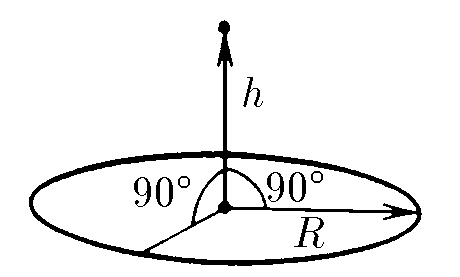

###  Условие: 

$6.1.17.$ Чему равна напряженность электрического поля в центре равномерно заряженного тонкого кольца радиуса $R$? Чему она равна на оси кольца на расстоянии $h$ от центра? Заряд кольца $Q$. 

 

###  Решение: 

В центре кольца два одинаковых противоположных небольших участка кольца создают напряжённости, равные по модулю и противоположные по направлению. По принципу суперпозиции результирующая напряжённость есть векторная сумма всех элементарных напряжённостей 

$$\vec{E}=\sum\vec{E_i}$$

Сумма противоположных по направлению векторов равна $\vec{0}$, а значит результирующая напряжённость равна нулю. На расстоянии $h$ от центра кольца проекции элементарных напряжённостей на плоскость кольца аналогичным образом скомпенсируются, но их проекции на ось кольца останутся. 

$$(E_i)_{Oh}=E_i \cdot \sin{\alpha}$$

где $\alpha$ — угол наклона $\vec{E_i}$ к плоскости кольца ($\tan{\alpha}=h/R$). 

$$E=\sum{(E_i)_{Oh}}=\sum{E_i \cdot \sin{\alpha}}$$

$$=\sum{\frac{1}{4\pi\varepsilon_0}\frac{\Delta{Q}}{R^2+h^2}\cdot \frac{h}{\sqrt{R^2+h^2}}}$$

где $\Delta{Q}$ — заряд малого участка, 

$$Q=\sum{\Delta{Q}}$$

$$E=\frac{1}{4\pi\varepsilon_0}\frac{Qh}{(R^2+h^2)^{3/2}}$$

####  Ответ: $0, \frac{1}{4\pi\varepsilon_0}\frac{hQ}{(R^2+h^2)^{3/2}}$ 
