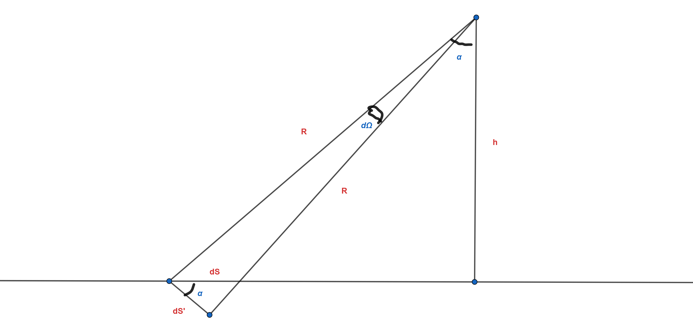

###  Условие:

$6.1.19.$ Докажите, что составляющая напряженности электрического поля, перпендикулярная поверхности равномерно заряженного участка плоскости, равна $E_\perp  = \frac{\sigma\Omega}{4\pi\varepsilon_0}$, где $\Omega$ — телесный угол, под которым виден этот участок из рассматриваемой точки пространства, $\sigma$ — поверхностная плотность заряда. Определите, пользуясь этим, напряженность электрического поля:
а) в центре куба, пять граней которого равномерно заряжены с поверхностной плотностью заряда $\sigma$, а одна грань не заряжена;
б) в центре правильного тетраэдра, три грани которого заряжены с поверхностной плотностью $\sigma_1$, а четвертая — с поверхностной плотностью заряда $\sigma_2$;
в) равномерно заряженной плоскости, если поверхностная плотность заряда $\sigma$;
г) на оси длинной трубы с сечением в виде правильного треугольника, если поверхностная плотность заряда граней треугольника трубы равна соответственно $\sigma_1$, $\sigma_2$, $\sigma_3$;
д) в вершине конуса с углом при вершине $\alpha$ и высоты $h$, равномерно заряженного с объемной плотностью заряда $\rho$;
е) на ребре длинного бруска, равномерно заряженного с объемной плотностью заряда $\rho$; поперечное сечение бруска — правильный треугольник со стороной $l$.

###  Решение:

По определению телесного угла:

$$
dS'=d\Omega{R^2}
$$

$$
S=\frac{dS'}{\cos{\alpha}}=\frac{d\Omega{R^2}}{h/R}=\frac{d\Omega{R^3}}{h}
$$

Заряд участка $dS$:

$$
dQ=dS \cdot \sigma =\frac{d\Omega\sigma{R^3}}{h}
$$

Вектор напряжённости, перпендикулярный плоскости:

$$
dE_n=dE \cdot \cos{\alpha}=\frac{1}{4\pi\varepsilon_0}\frac{d\Omega\sigma{R^3}}{hR^2} \cdot \frac{h}{R}=\frac{\sigma{d}\Omega}{4\pi\varepsilon_0}
$$

$$
E_n=\int_0^\Omega{\frac{\sigma{d}\Omega}{4\pi\varepsilon_0}}=\frac{\sigma\Omega}{4\pi\varepsilon_0}
$$

a) Полный телесный угол - 4$\pi$срад.

У куба 6 граней, каждая из граней ограничивает 1/6 часть пространства, т.е. они видны из центра под углом $4\pi /6=2\pi /3$срад.

Напряжённости противоположных граней полностью компенсируют друг друга (симметрия). Есть 2 пары противоположных граней и одна свободная - она-то и будет создавать напряжённость.

$$
E=\frac{\sigma\cdot 2\pi /3}{4\pi\varepsilon_0}=\frac{\sigma}{6\varepsilon_0}
$$

б) Грани тетраэдра ограничивают четверть пространства, их телесный угол - $\pi$срад. Три одинаково заряженные грани и последняя грань создадут векторы напряжённости, направленные вдоль высоты тетраэдра, и противоположные друг другу по направлению (прилежащие к высоте грани тетраэдра наклонены к ней под углом, синус которого равен $1/3$):

$$
E=\frac{\sigma_2\pi}{4\pi\varepsilon_0}-3\frac{\sigma_1\pi}{4\pi\varepsilon_0} \cdot \sin{\alpha}=\frac{\sigma_2}{4\varepsilon_0}-\frac{\sigma_1}{4\varepsilon_0}=\frac{\sigma_2-\sigma_1}{4\varepsilon_0}
$$

в) Плоскость ограничивает половину пространства, её телесный угол - $2\pi$срад

$$
E=\frac{\sigma\cdot 2\pi}{4\pi\varepsilon_0}=\frac{\sigma}{2\varepsilon_0}
$$

г) Грани трубки ограничивают треть пространства, их телесный угол - $4\pi /3$срад. Три грани создадут три вектора, направленных под углом $120 ^{\circ}$ друг к другу, с модулем, который задаётся формулой

$$
E_i=\frac{\sigma_i}{3\varepsilon_0}.
$$

Запишем проекции векторов на ось вектора $E_1$:

$$
E_\parallel=E_1-E_2\cdot\cos60^\circ-E_3\cdot\cos60^\circ=E_1-E_2/2-E_3/2
$$

$$
E_\perp=E_2\cdot\sin60^\circ-E_3\cdot\sin60^\circ=\frac{\sqrt3}{2}(E_2-E_3)
$$

$$
E=\sqrt{E_\parallel^2+E_\perp^2}=\sqrt{(E_1-E_2/2-E_3/2)^2+(\frac{\sqrt{3}}{2}(E_2-E_3))^2}=
$$

$$
=\sqrt{E_1^2+E_2^2/4+E_3^2/4-E_1E_2-E_1E_3+2E_2E_3/4+\frac{3}{4}E_2^2+\frac{3}{4}E_3^2-\frac{3}{2}E_2E_2}=
$$

$$
=\sqrt{\sigma_1^2+\sigma_2^2+\sigma_3^2-\sigma_1\sigma_2-\sigma_2\sigma_3-\sigma_1\sigma_3/(3\varepsilon_0)}
$$

д) Будем разрезать конус на малые диски, перпендикулярные высоте, радиус диска - $r$, толщина - $dx$. Каждый из дисков виден из вершины под одним и тем же телесным углом

$$
\Omega=2\pi (1-\cos{\alpha})
$$

(известный факт, выводится интегрированием площади участка сферы по углу).

Поверхностная плотность заряда дииска:

$$
\sigma =\frac{\rho\cdot V}{S}=\frac{\rho\pi{r}^2 \cdot dx}{\pi{r}^2}=\rho{dx}
$$

Напряжённость, создаваемая диском:

$$
dE=\frac{\sigma\Omega}{4\pi\varepsilon_0}=\frac{\rho{dx}2\pi (1-\cos{\alpha}}{4\pi\varepsilon_0}=\frac{\rho{dx}(1-\cos{\alpha}}{2\varepsilon_0}
$$

$$
E=\int_0^h\frac{\rho{dx}(1-\cos{\alpha})}{2\varepsilon_0}=\frac{\rho{h}(1-\cos{\alpha})}{2\varepsilon_0}
$$

е) Аналогично пункту д) будем разбивать на длинные прямоугольники(длина - $\Delta{L}$, ширина - $a$, толщина - $dx$).

Каждый прямоугольник виден под телесным углом

$\Omega=4\pi\frac{60 ^{\circ}}{360 ^{\circ}}=2\pi /3$ срад (шестая часть пространства)

$$
\sigma =\frac{\rho\cdot V}{s}=\frac{\rho\cdot \Delta{L}a \cdot dx}{\Delta{L}a}=\rho{dx}
$$

$$
E=\int_0^{h}\frac{\sigma\Omega)}{4\pi\varepsilon_0}=\int_0^{\frac{\sqrt{3}}{2}l}\frac{\rho{dx}2\pi /3}{4\pi\varepsilon_0}=\frac{\sqrt{3}\rho{l}}{12\varepsilon_0}
$$

#### Ответ:

a) \( E = \frac{\sigma}{6\varepsilon_0} \);
б) \( E = \frac{\sigma_1 - \sigma_2}{4\varepsilon_0} \);
в) \( E = \frac{\sigma}{2\varepsilon_0} \);
г) \( E = \sqrt{\sigma_1^2 + \sigma_2^2 + \sigma_3^2 - \sigma_1\sigma_2 - \sigma_2\sigma_3 - \sigma_1\sigma_3}/(3\varepsilon_0) \);
д*) \( E = \frac{\rho h (1 - \cos \alpha)}{2\varepsilon_0} \);
е*) \( E = \frac{\sqrt{3} l \rho}{12\varepsilon_0} \).